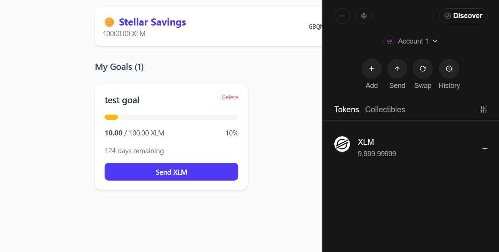
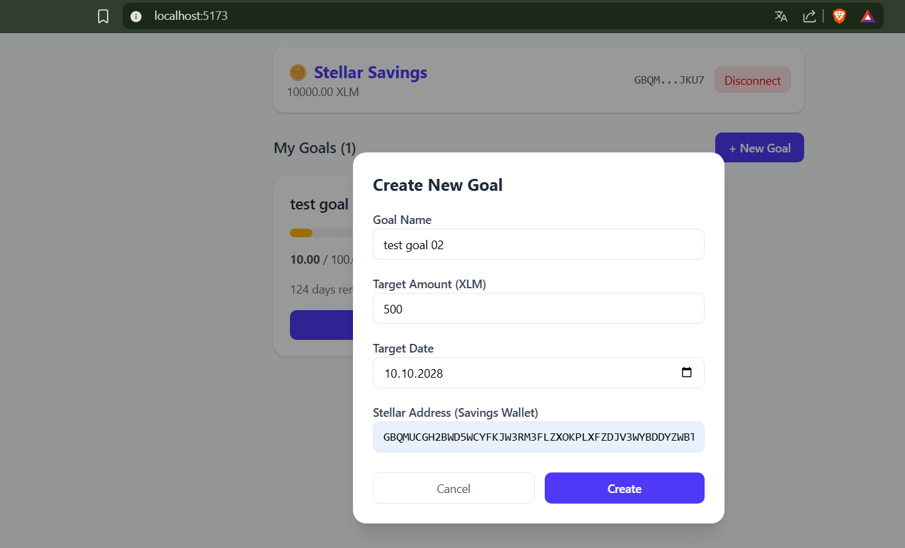
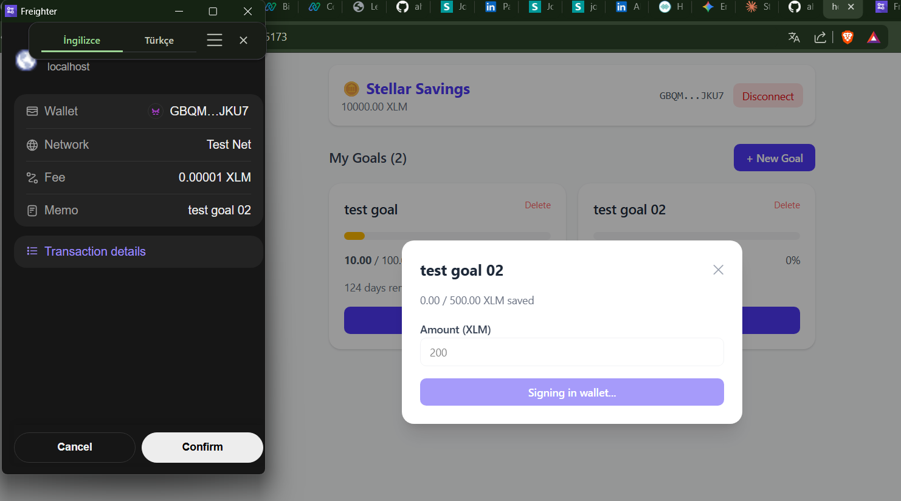
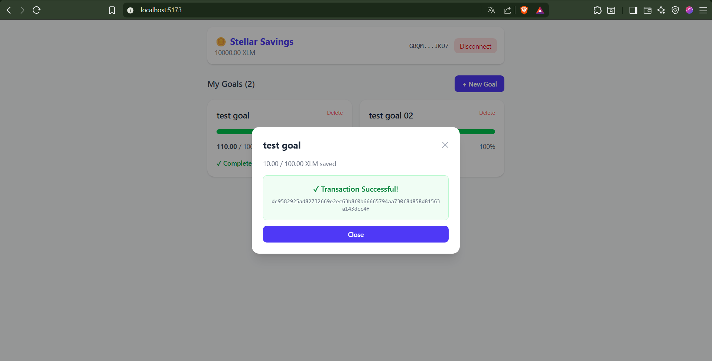

# Stellar Savings 🪙

A Stellar testnet savings goals dApp. Set XLM savings targets with deadlines, send incremental payments, and track your progress.

## Features

- Connect/disconnect Freighter wallet (Stellar Testnet)
- View XLM balance
- Create savings goals with name, target amount, and target date
- Send XLM toward any goal via testnet transactions
- Visual progress bar and countdown for each goal
- Goals persist in browser localStorage

## Prerequisites

- Node.js 20+
- [Freighter wallet extension](https://www.freighter.app/) installed in Chrome/Firefox
- Freighter set to **Testnet** network
- A funded testnet account (use [Stellar Friendbot](https://laboratory.stellar.org/#account-creator?network=test))

## Setup

```bash
git clone <your-repo-url>
cd hedef-kumbarasi
npm install
npm run dev
```

Open http://localhost:5173

## Run Tests

```bash
npm test
```

## Build

```bash
npm run build
```

## Screenshots

### Wallet Connected & Balance Displayed


### Create New Goal


### Transaction Signing


### Transaction Successful


## Tech Stack

- React 18 + Vite 5 + TypeScript
- Tailwind CSS
- @stellar/stellar-sdk + @stellar/freighter-api
- Vitest + Testing Library
